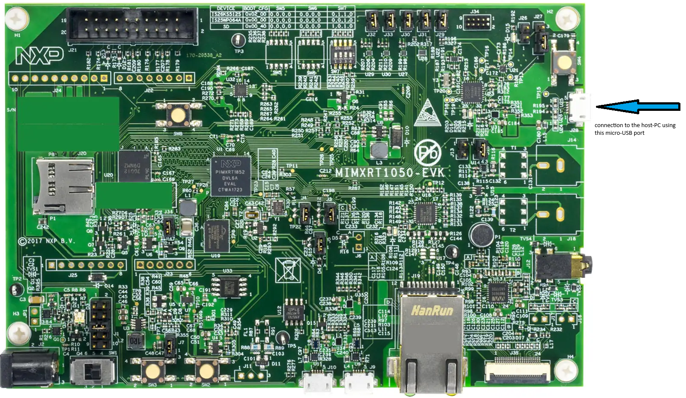
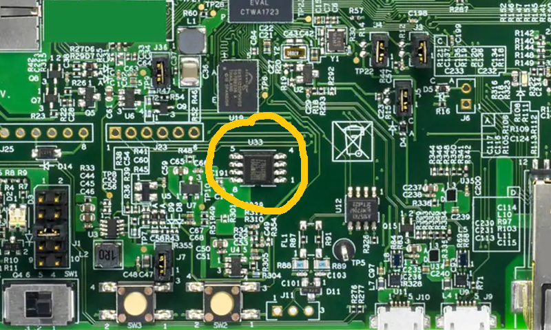
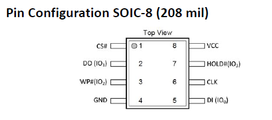
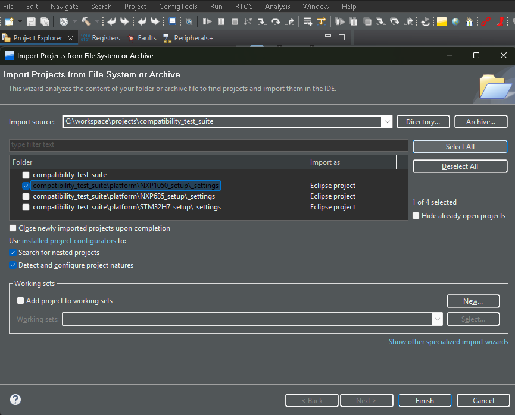
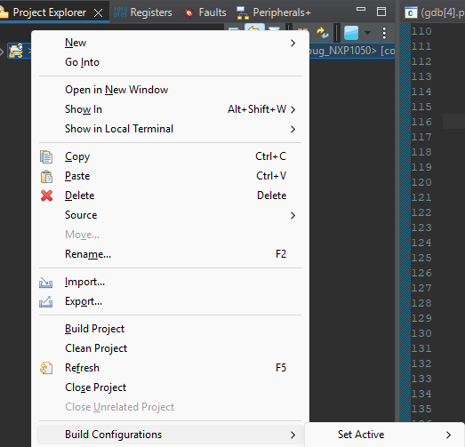
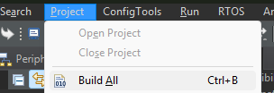

<h4 { style="margin-bottom: 0px;" }><u>NXP IMXRT1050-EVKB platform instructions</u></h4>

<h4 { style="margin-bottom: 0px;" }><u>Zooming in on the U33 (QSPI Flash) location</u></h4>
 

<h4 { style="margin-bottom: 0px;" }><u>Flash device pin configuration</u></h4>
 

<h4 { style="margin-bottom: 0px;" }><u>Board ECN instructions</u></h4>
<ol>
	<li>Replace the original QSPI Flash ISSI IS25WP064AJBLE (U33) with a Winbond W77Q/T  Secure Flash Device flash device in an SOIC-8 package.</li>
	<li>0ohm streering resistors replacement (located at the bottom side):  
	<ol  style="list-style-type: lower-alpha;"; >
		<li>remove resistors R356, R361-R366, R49</li>
		<li>solder resistors R153-R158</li>
	</ol></li>
	<li>Dip switch settings OFF-OFF-ON-OFF to boot from the QSPI Flash device</li>
</ol>
 

<h4 { style="margin-bottom: 0px;" }><u>SW integration</u></h4>
<ol>
	<li>SW Installation (*):
	<ol  style="list-style-type: lower-alpha;"; >
		<li>NXP IDE - MCUXpresso IDE v25.6 [Build 136][2025-06-27]</li>
		<li>SDK_2.x_EVKB-IMXRT1050 version 2.16.000 (847 2024-07-12) Manifest Version 3.14.0</li>
		<li>Clone Winbond's Compatibility tests repository</li>
		</ol></li> 
	<li>Load the project:
	<ol  style="list-style-type: lower-alpha;"; >
		<li>Import the project
		

</li> 
		<li>Select the folder which contains the .cproject
		

</li> 
		<li>Click Finish
		

</li> 
	</ol></li> 
</ol>

<h4 { style="margin-bottom: 0px;" }><u>Compile:</u></h4>
<ol>
	<li>right-click on the project -> Build Configurations -> Set Active -> Debug_NXP1050 as the active build,
	

</li> 
	<li>then, (at the above associative menu) choose <strong>Build All</strong> or  <string>[CTRL]+B</strong> or <strong>project->Build All</strong>
	

</li> 
</ol>

<h4 { style="margin-bottom: 0px;" }><u>Run:</u></h4>
<ol>
	<li>click on the run Icon
	

</li> 
	<li>Observe the test result on the output panel</li> 
	<li>Compare the test result to the log file. the logs are located inside the logs/ folder
	

</li> 
</ol>

(*)Note: The mentioned IDE and SDK versions were validated by Winbond to work with this setup. Other IDE and SDK versions may also work.

[← Return to Parent](../../../README.md)
