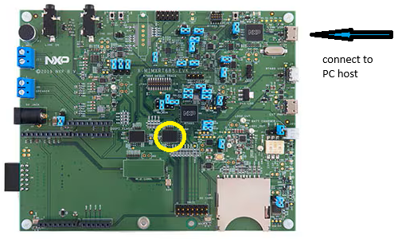
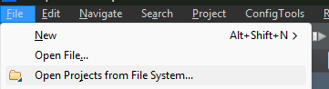
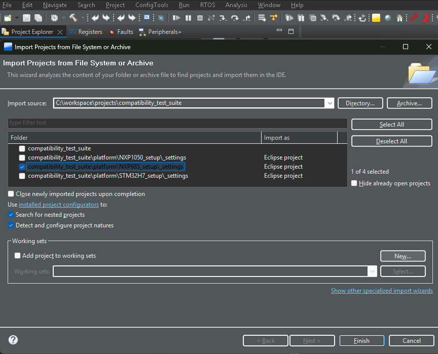

<h4 { style="margin-bottom: 0px;" }><u>NXP IMXRT685-EVKB platform instructions</u></h4>
 
Replace the on board flash device (marked with a yellow circle) with a Winbond W77T Octal SPI device in a 24-Ball 8x6-mm TFBGA package.  

<h4 { style="margin-bottom: 0px;" }><u>SW integration</u></h4>
<ol>
	<li>SW Installation (*):
	<ol type="a">
		<li>NXP IDE - MCUXpresso IDE v25.6 [Build 136][2025-06-27]</li>
		<li>SDK_2.x_EVKB-IMXRT685 version 25.09.00 (epluginsite815 2025-09-22) Manifest Version 3.15.0</li>
		<li>Clone  Winbond's Compatibility tests repository
	</ol></li>
	 
	<li>Load the project:
	<ol type="a">
		<li>Import the project:
		

</li> 
		<li>Select the folder which contains the .cproject
		

</li> 
		<li>click Finish
		

</li> 
	</ol></li>
</ol>

<h4 { style="margin-bottom: 0px;" }><u>Compile</u></h4>
<ol>
   <li>Right-click on the project -> Build Configurations -> Set Active -> Debug_NXP685 as the active build,
   

</li> 
   <li>then, (at the above associative menu) choose Build Project   or   [CTRL]+B   or project->Build All
   

</li> 
</ol>

<h4 { style="margin-bottom: 0px;" }><u>Run</u></h4>
<ol>
	<li>Click the link server
	

</li> 
	<li>Observe the test result on the output panel</li>
	<li>Compare the test result to the log file. the logs are located inside the logs/ folder
	

</li> 
</ol>
  
(*)Note: The mentioned IDE and SDK versions were validated by Winbond to work with this setup. Other IDE and SDK versions may also work.

---
[← Return to Parent](../../../README.md)