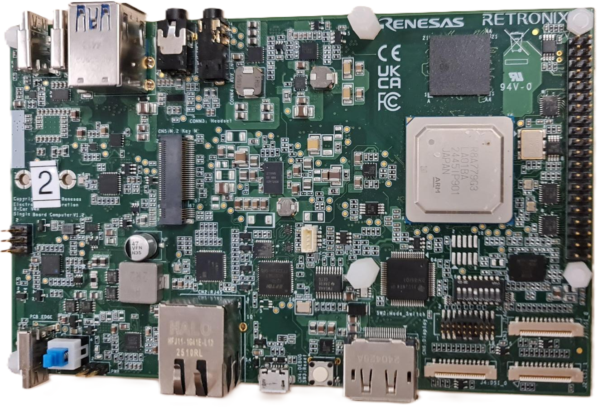
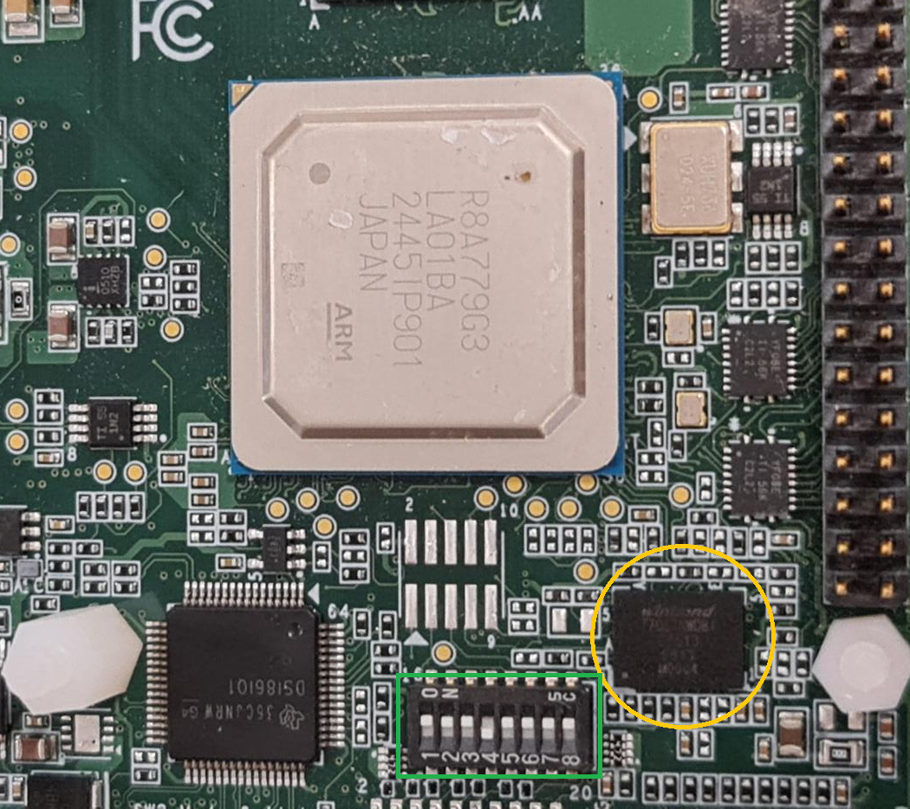
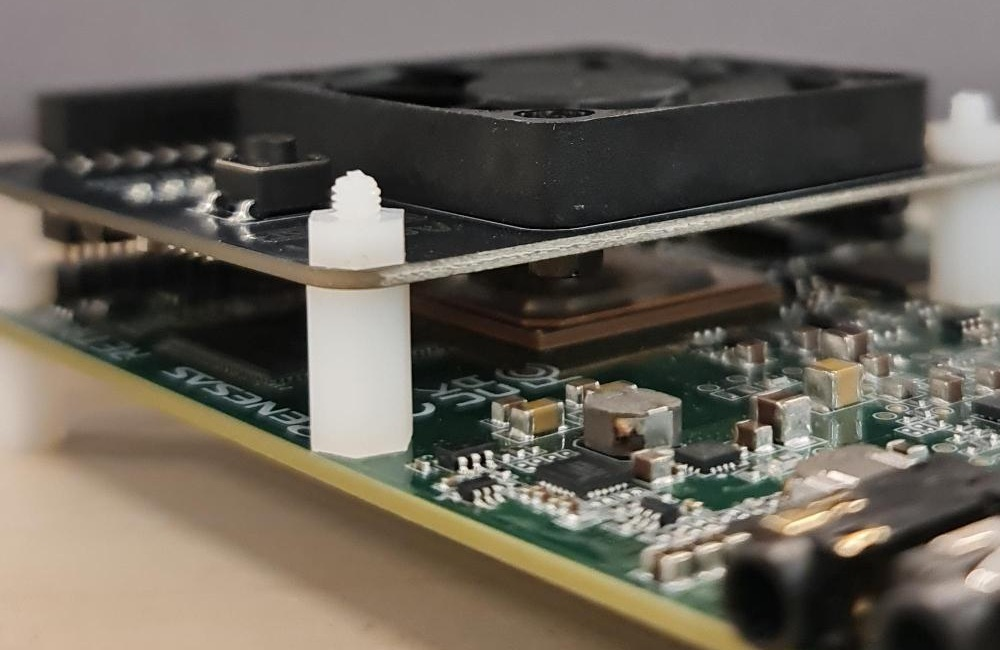
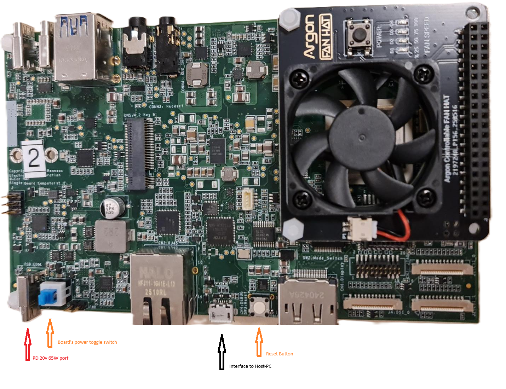
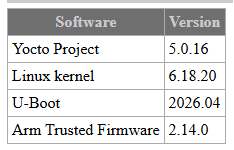
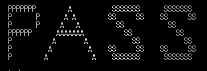
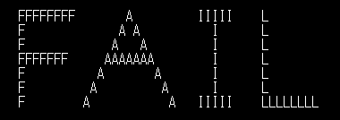

<h2> <u>Renesas Sparrow Hawk R-Car V4H - platform instructions</u></h2>

 
 

<h3><u> Hardware integration</u></h3>
 

 

1. A Winbond Secure Flash device W77Q51NWD (circled in yellow) is already mounted on board
2. Modify the On-board SW2 DIP-SW (enveloped by the Green rectangle) to 11101111 (SW2.4=Off, all others=On)
 
 

3. Attach a Fan to allow heat dissipation from the High Power (65W) board.  
   Use two plastic standoffs for keeping the Fan securely attached to the board.

 

4. Connect a <strong>USB-PD 20V type-C</strong> to the board's <strong>USB_PS port</strong> 
5. connect a <strong>Micro USB cable</strong> between the host-PC and the Board's Serial port (CN4: DEBUG port)
6. The SPI bus runs at 40MHz and using 1-4-4 type transactions
7. The PC communicates with the Renesas MCU via the UART configured to 921600 bps, 8N1

 
<h3><u> Software integration</u></h3>
The setup runs Linux OS on the micro-SD card. Follow the next steps to prepare such a card: 

1. Acquire a 16GB micro-SD card  
2. Download the OS (Our test runs on the Yocto BSP linux rootfs, but there may be other OS flavours which run on this setup as well).  
The test was run with the following SW versions   
      a. Open a Browser at the address: https://rcar-community.github.io/Sparrow-Hawk/BSP/yocto_bsp.html 
      b. Download the Yocto BSP linux rootfs image file: core-image-minimal-sparrow-hawk.rootfs.wic.gz 
      c. Download the balenaEtcher programmer: https://etcher.balena.io/#download-etcher  
      d. Use the Programmer with the image file to prepare the micro-SD card
 
3. Copy the Compatibility test source files into the Renesas micro SD card root folder (/home/root)
  

Notes:
1. The Renesas micro SD card uses the linux ext4 file system which is not recognized by windows.
2. The compatibility test runs in user space and requires no changes to the kernel or Linux rootfs.

 
<h3><u>Running the test</u></h3>

1. Make sure the micro-SD card is inserted to the micro-SD slot
2. Connect the power-supply to the PD port.
3. Connect the board's COM port to the host-PC
4. Open a terminal (for example TeraTerm) to capture the boot and test logs
5. Turn on the board by pressing the power toggle button
6. The onboard reset button can be applied when required
7. At the Linux login prompt, enter "root"
8. Run (once) the command chmod +x compatibility_test.sh
9. At the prompt, run the command ./compatibility_test.sh <ENTER>
10. The test log will appear with a PASS/FAIL banner text as shown in the examples below

 

---
[← Return to Parent](../../../README.md)
