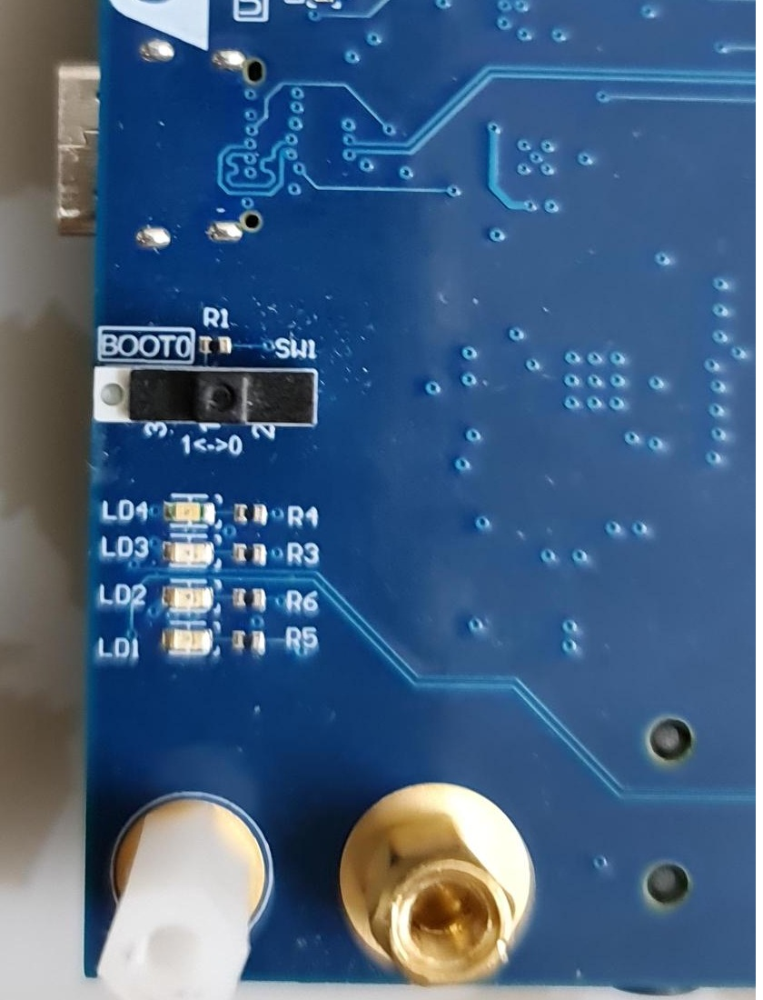
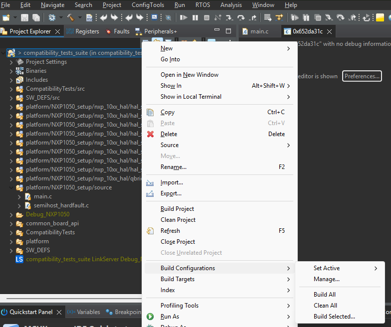

<h2><u>STM32H7S78DK MB1736D platform instructions</u></h2>

  
<h4 { style="margin-bottom: 0px;" }><u>HW integration</u></h4>
   
   
<b><u>Prepare the HW as follows:</u></b> 
  1. Remove the on board U23 device (see the Yellow circule) 
  2. Replace with Winbond device (for example W77T64NWS) 
  3. Connect a USB-C cable to the board's STLINK port on one side (see the green arrow above) 
  4. Make sure theat the mechanical switch <strong>BOOT0 (SW1)</strong> is set to <strong>0</strong> position as in the image below 
     

 
<h4 { style="margin-bottom: 0px;" }><u>SW integration</u></h4>

1. Install the STM32CubeIDE - version 2.0.0 Build: 26820_20251114_1348
2. Install the STMCubeIDE terminal console or any other terminal tool
3. Clone the Winbond's Compatibility tests repository
4. Load the Project
5. Compile
6. Run the test
 

<u><b>Installation steps details:</b></u>

1. <u>Install the STM32CubeIDE - version 2.0.0 Build: 26820_20251114_1348</u>
    The test was run on the version & build as mentioned above, but it may run on other versions 
2. <u>Install the STMCubeIDE terminal console or any other terminal tool</u>
   This step is optional, you can skip this step if you only want a pass/fail indication by the LEDs or when using external terminal tool.
   The test was run on the STM32H7S78DK with the following serial connection settings "115200bps 8N1". 
   <u>Following are the steps for installing the IDE's terminal console</u> 

   a. Click on Menu->Help -> "Install new Software.."
      

 
   b. Select from the combo-box the item <strong>Eclipse SimRel 2024-09 - https://download.eclipse.org/releases/2024-09</strong>
      

 
    c. Wait for few minutes while the available addons are being collected
       

 
    d. In the Filter line (above the populated list) write terminal
       

 
    e. Click on the checkbox of <strong>TM Terminal Connector Extensions</strong> and then, Click <strong>Next</strong>
       

 
    f. Click <strong>Finish</strong>
       

 
    g. At the bottom right corner you wlil see the installation progress
       

 
    h. Once the installation is done, you will be prompetd to restat the IDE - Do it  
    i. Now, create a new Console and configure to accept the STM32H7 log transmissions
       

 
    j. Select <strong>Command Shell Console</strong> and fill the parameters as shown in the image
       

 
    k. Select <strong>New</strong> verify the serial port parameters as in the image
       

 
    l. Connect the STLink port of the board via a USB-C cable to the host computer and the comm port wlil be automatically filled.  
    m. Name the connection and click Finish and then click OK.
       

 
    n. Switch between the different console contents (build-log / run-log /  <strong>STM32H7S78DK output</strong>) by clicking on the blue row
       

  

  3. <u>Clone the Winbond's Compatibility tests repository</u>  
    The project was created using the STM32CubeMX GUI (with STM32Cube FWH7RS V1.2.0, toolchain/IDE=stmCubeIDE, enable XSPI2 & UART4 & <strong>generate the code</strong> to create the project). 
    <u>SW changes that were made include:</u>
    a. stm32h7_bsp\Boot\Inc\stm32h7rsxx_hal_conf.h      // HAL configuration file 
    b. stm32h7_bsp\Boot\Inc\stm32h7rsxx_it.h            // Interrupt handlers header file 
    c. stm32h7_bsp\Boot\Src\stm32h7rsxx_it.c            // Interrupt handlers 
    d. stm32h7_bsp\Boot\Src\stm32h7rsxx_hal_msp.c       // HAL MSP module 
    e. stm32h7_bsp\Boot\Src\system_stm32h7rsxx.c        // STM32H7RSxx system source file 
    f. The SystemClock_Config() function is used to configure the system clock (SYSCLK) to run at 600 MHz 
    

  4. <u>Load the project</u> 
    a. In the IDE click on [File]->Import Projects from File System or Archive 
        
    b. Click on the <strong>Directory</strong> 
        
    c. At the opened GUI, Browse to the root folder of the suite and click <strong>Select Folder</strong>
        
    d. Un-select all but the STM32H7_setup checkboxes, then, click on the <strong>Finish</strong>
        

  5. <u>Compile</u> 
    Right-click on the project -> Build Configurations -> Set Active -> Debug as the active build,  
    then, (at the above associative menu) choose <strong>Build Project</strong> or  <strong>[CTRL]+B</strong> or <strong>project->Build All</strong> 
      
  
  6. <u>Run the test</u> 
    a. connect the board's STLink port to the host computer 
    b. Opitonal for the internal console terminal - to receive the log messages switch the view <strong>command shell console</strong> to the sarial connection name 
    c. Click the Bug in Debug mode with breakpoint capability, or, click the right-pointing triangle to Run 
       
    d. The test result sets either the green (test pass) or RED (test fail) LEDs which are located at the bottom side of the board 
    e. Observe the green or red LEDs 
         
       Example for test pass indication 
         
       Example for test fail indication 
         
    f. Compare the test result to the log files which are located under the logs/ folder 

###### (*)Note: The mentioned IDE and TERATERM versions have been validated by Winbond. Different IDE and TERATERM versions may work as well.
---
[← Return to Parent](../../../README.md)

