<h2><u>STM32H7S78DK MB1736D platform instructions</u></h1>
 
 
<h4 { style="margin-bottom: 0px;" }><u>HW integration</u></h4>
 
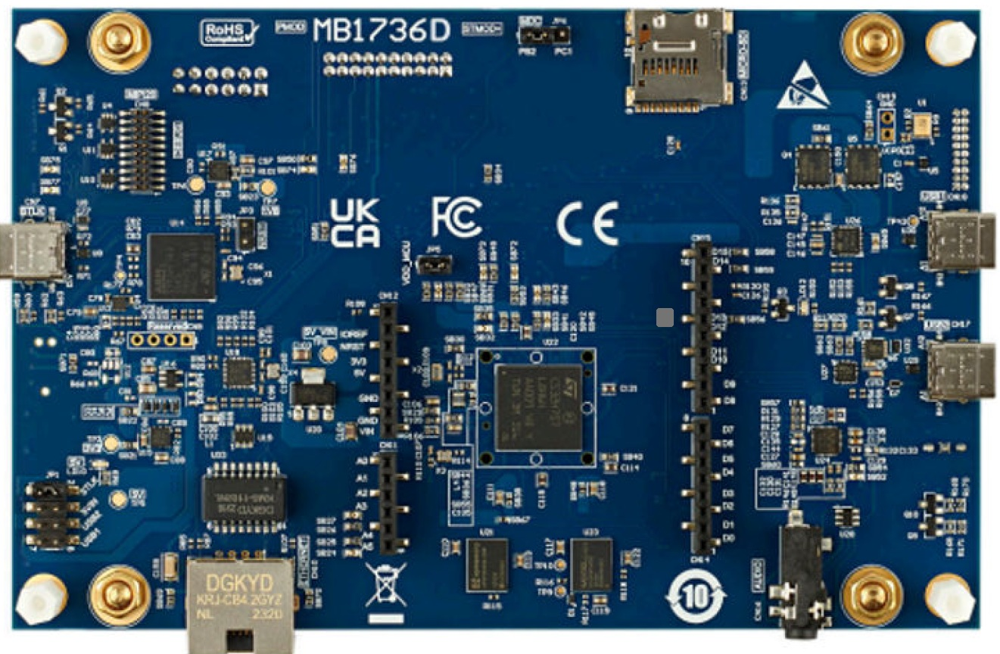 
 
<ol margin-top="0px"; margin-bottom="0px"; margin-left="0"; type="a"><b><u>Prepare the HW as follows:</u></b>
  <li> Remove the on board U23 device (see the Yellow circule)</li>
  <li> Replace with Winbond device (for example W77T64NWS)</li>
  <li>Connect a USB-C cable to the board's STLINK port on one side (see the green arrow above)</li>  
   
  

 
  <li>Make sure theat the mechanical switch <strong>BOOT0 (SW1)</strong> is set to <strong>0</strong> position as in the above image</li>
</ol>

 
<u><h4 { style="margin-bottom: 0px;" }>SW integration</u></h4>
<ol>
  <li>Installation steps:
  <ol  style="list-style-type: lower-alpha;"; margin-top="0px"; margin-bottom="0px"; margin-left="0";>
    <li>Install the STM32CubeIDE - version 2.0.0 Build: 26820_20251114_1348</li>
    <Li>Install the STMCubeIDE terminal console or any other terminal tool</li>
    <li>Clone the Winbond's Compatibility tests repository</li>
    <li>Load the Project</li>
    <li>Compile</li>
    <li>Run the test</li>
  </ol></li> 

  <Li>Installation steps details:
  <ol style="list-style-type: lower-alpha;"; margin-top="0px"; margin-bottom="0px"; margin-left="0">
    <li><u><b>Install the STM32CubeIDE - version 2.0.0 Build: 26820_20251114_1348</b></u> 
    The test was run on the version & build as mentioned above, but it may run on other versions</li> 
    <li><u><b>Install the STMCubeIDE terminal console or any other terminal tool</b></u> 
    This step is optional, you can skip this step if you only want a pass/fail indication by the LEDs or when using external terminal tool. 
    The test was run on the STM32H7S78DK with the following serial connection settings "115200bps 8N1".  
    <u>Following are the steps for installing the IDE's terminal console</u>
     <ol  style="list-style-type: decimal;">
      <li> Click on Menu->Help 
      
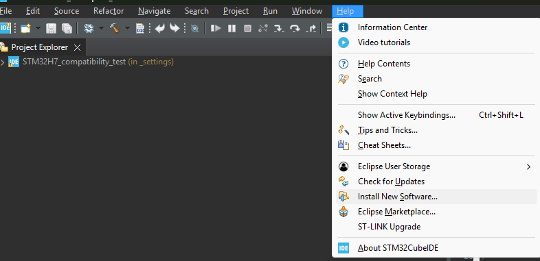
</li> 
      Click "Install new Software.." 
      <li> Select from the combo-box the item <strong>Eclipse SimRel 2024-09 - https://download.eclipse.org/releases/2024-09</strong> 
      

</li> 
      <li> Wait for few minutes while the available addons are being collected 
      

</li> 
      <li> In the Filter line (above the populated list) write terminal 
      

</li> 
      <li> Click on the checkbox of <strong>TM Terminal Connector Extensions</strong> and then, Click <strong>Next</strong>
      

</li>       
      <li>Click <strong>Finish</strong> 
      
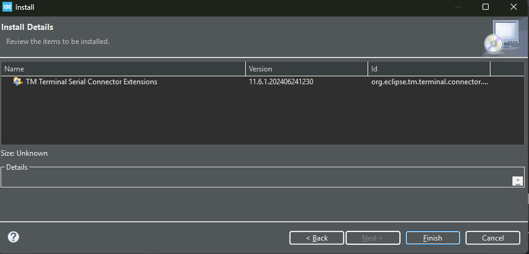
</li> 
      <li> At the bottom right corner you wlil see the installation progress 
      
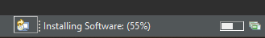
</li> 
      <li> Once the installation is done, you will be prompetd to restat the IDE - Do it</li> 
      <li> Now, create a new Console and configure to accept the STM32H7 log transmissions 
      

</li> 
      <li> Select <strong>Command Shell Console</strong> and fill the parameters as shown in the image 
      
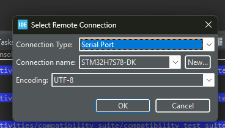
 
      <li> select <strong>New</strong> verify the serial port parameters as in the image  
      
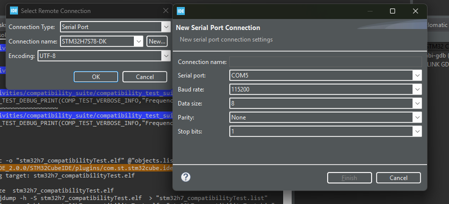
</li> 
      <li>Connect the STLink port of the board via a USB-C cable to the host computer and the comm port wlil be automatically filled. 
      Name the connection and click Finish and then click OK. 
      

</li>
      <li>Switch between the different console contents (build-log / run-log /  <strong>STM32H7S78DK output</strong>) by clicking on the blue arrow 
      
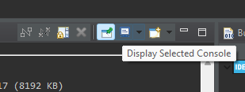
</li> 
      </ol>
    </li>
    <li><u><b>Clone the Winbond's Compatibility tests repository</b></u> 
    The project was created using the STM32CubeMX GUI (with STM32Cube FWH7RS V1.2.0, toolchain/IDE=stmCubeIDE, enable XSPI2 & UART4 & <strong>generate the code</strong> to create the project). 
    SW changes that were made include</strong>: 
    <ol  style="list-style-type: decimal"; >
      <li>stm32h7_bsp\Boot\Inc\stm32h7rsxx_hal_conf.h      // HAL configuration file</li>
      <li>stm32h7_bsp\Boot\Inc\stm32h7rsxx_it.h            // Interrupt handlers header file</li>
      <li>stm32h7_bsp\Boot\Src\stm32h7rsxx_it.c            // Interrupt handlers</li>
      <li>stm32h7_bsp\Boot\Src\stm32h7rsxx_hal_msp.c       // HAL MSP module</li>
      <li>stm32h7_bsp\Boot\Src\system_stm32h7rsxx.c        // STM32H7RSxx system source file</li>
      <li>The SystemClock_Config() function is used to configure the system clock (SYSCLK) to run at 600 MHz</li>
    </ol></li>
     
    <li><u><b>Load the project</u></b>
    <ol style="list-style-type: decimal;">
      <li>In the IDE click on [File]->Import Projects from File System or Archive
      

</li> 
      <li>click on the <strong>Directory</strong>
      
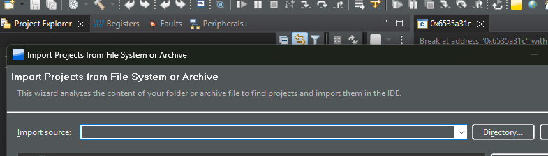
</li> 
      <li>At the opened GUI, Browse to the root folder of the suite and click <strong>Select Folder</strong>
      

</li> 
      <li>un-select all but  the STM32H7_setup checkboxes, then, click on the <strong>Finish</strong>
      
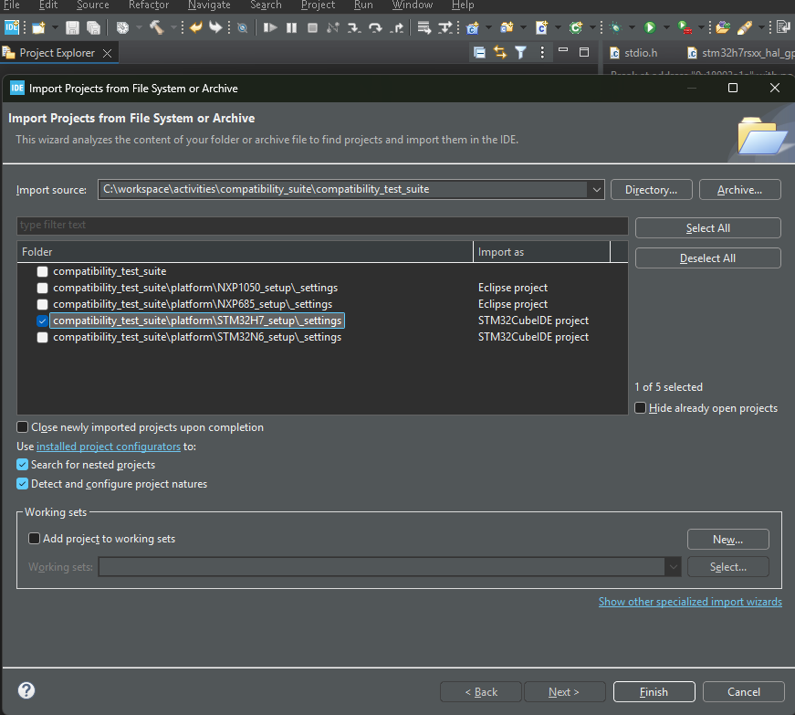
</li> 
    </ol></li>
     
    <li><u><b>Compile</b></u> 
      Right-click on the project -> Build Configurations -> Set Active -> Debug as the active build,  
      then, (at the above associative menu) choose <strong>Build Project</strong> or  <strong>[CTRL]+B</strong> or <strong>project->Build All</strong> 
      
    </li>
     
    <li><u><b>Run the test</b></u> 
    <ol  style="list-style-type: decimal;" >
      <li>connect the board's STLink port to the host computer</li>
      <li>Opitonal for the internal console terminal - to receive the log messages switch the view <strong>command shell console</strong> to the desired connection name.
      <li>Click the Bug in Debug mode with breakpoint capability, or, click the right-pointing triangle to Run
        

</li> 
      <li>The test result sets either the green (test pass) or RED (test fail) LEDs which are located at the bottom side of the board.</li> 
      <li>Observe the green or red LEDs
        
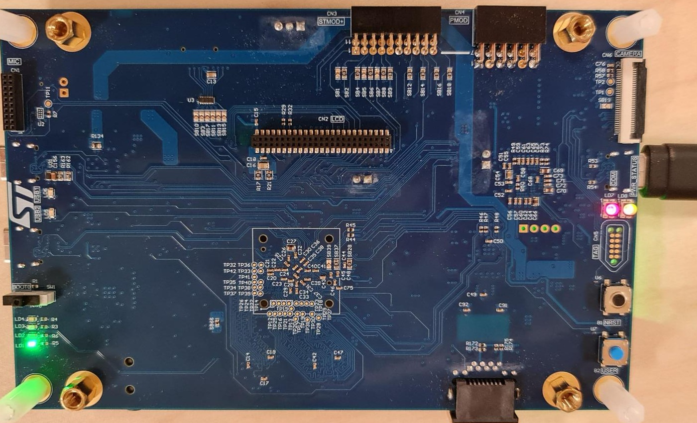
 
        
Example for test pass indication

        
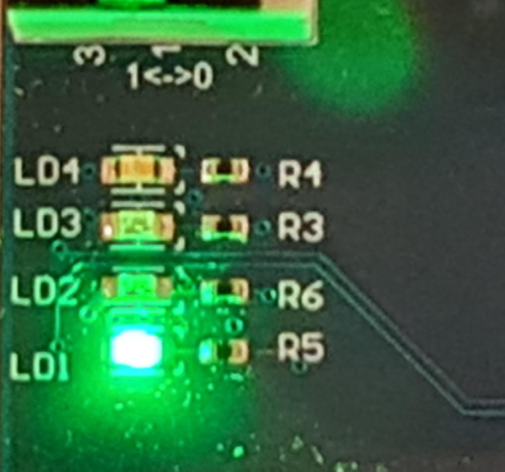
 
        
Example for test fail indication

        
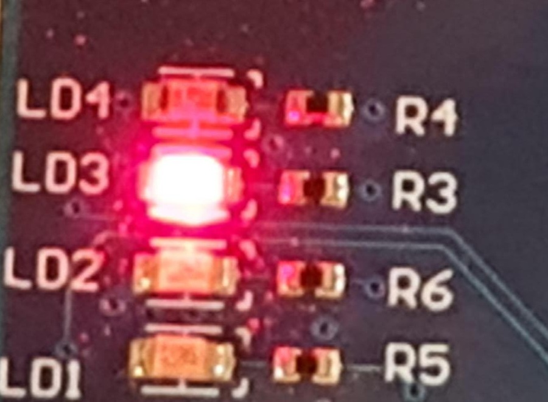
 
      </li>
      <li>Compare the test result to the log files which are located under the logs/ folder</li> 
    </ol>
    </li>
  </ol>
  </li>
</ol>

###### (*)Note: The mentioned IDE and TERATERM versions have been validated by Winbond. Different IDE and TERATERM versions may work as well.
---
[← Return to Parent](../../../README.md)