<h2><u>STM32N6570-DK MB1939C platform instructions</u></h1>
 
<h4 { style="margin-bottom: 0px;" }><u>HW integration</u></h4>
 
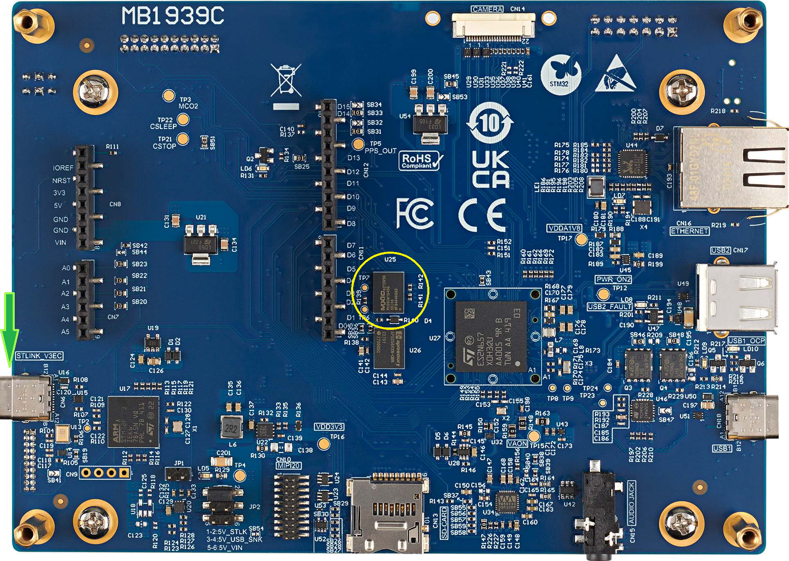 
 
<b><u>Prepare the HW as follows:</u></b> 

1. Remove the on board U25 device (see the Yellow circle) 
2. Replace with Winbond device (for example W77T25NW1) 
 

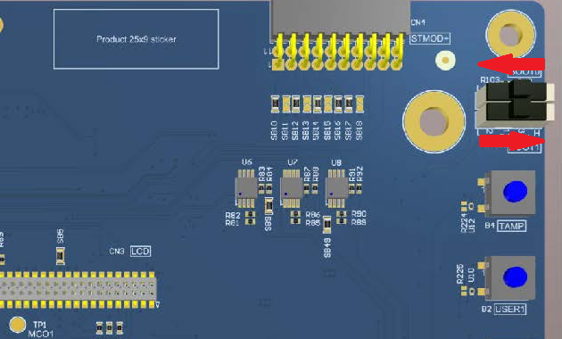

3. Make sure that the mechanical switch <strong>BOOT1</strong> is set to <strong>H</strong> position (see the red arrows above) 
4. Connect a USB-C cable to the board's STLink port on one side indicated as a green arrow 

 
<u><h4 { style="margin-bottom: 0px;" }>SW integration</u></h4>

1. Install the STM32CubeIDE - version 2.0.0 Build: 26820_20251114_1348
2. Install the STMCubeIDE terminal console or any other terminal tool
3. Clone the Winbond's Compatibility tests repository
4. Load the Project
5. Compile
6. Run the test
 

<u><b>Installation steps details:</b></u>

1. <u>Install the STM32CubeIDE - version 2.0.0 Build: 26820_20251114_1348</u> 
    The test was run on the version & build as mentioned above, but it may run on other versions  
2. <u>Install the STMCubeIDE terminal console or any other terminal tool</u> 
   This step is optional, you can skip this step if you only want a pass/fail indication by the LEDs or when using external terminal tool. 
   The test was run on the STM32N6570DK with the following serial connection settings "115200bps 8N1". 
   <u>Following are the steps for installing the IDE's terminal console</u>

   a. Click on Menu->Help -> "Install new Software.."
      
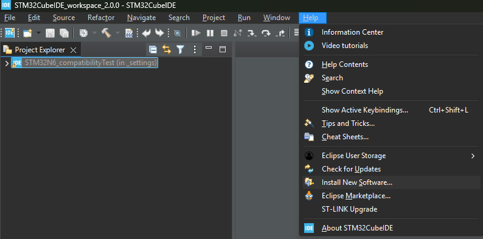
 
   b. Select from the combo-box the item <strong>Eclipse SimRel 2024-09 - https://download.eclipse.org/releases/2024-09</strong>
      
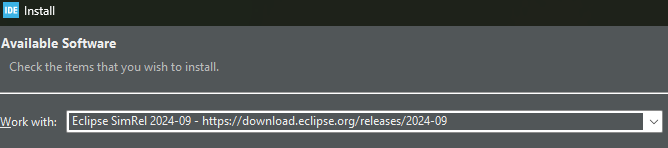
 
   c. Wait for few minutes while the available addons are being collected 
      
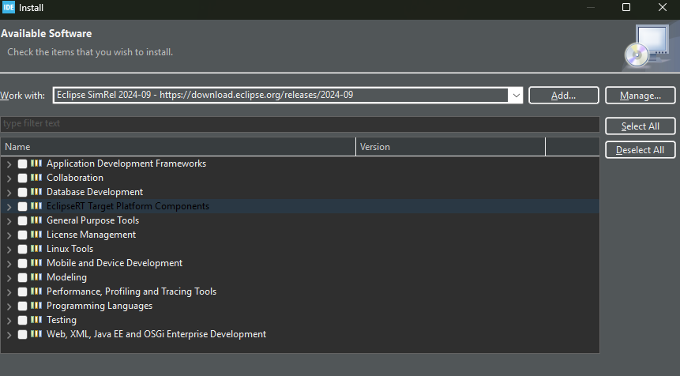
 
   d. In the Filter line (above the populated list) write terminal 
      
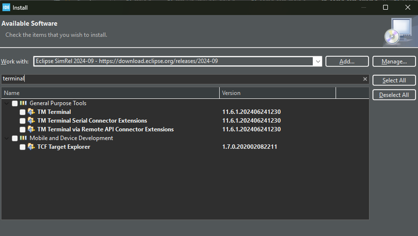
 
   e. Click on the checkbox of <strong>TM Terminal Connector Extensions</strong> and then, Click <strong>Next</strong>
      
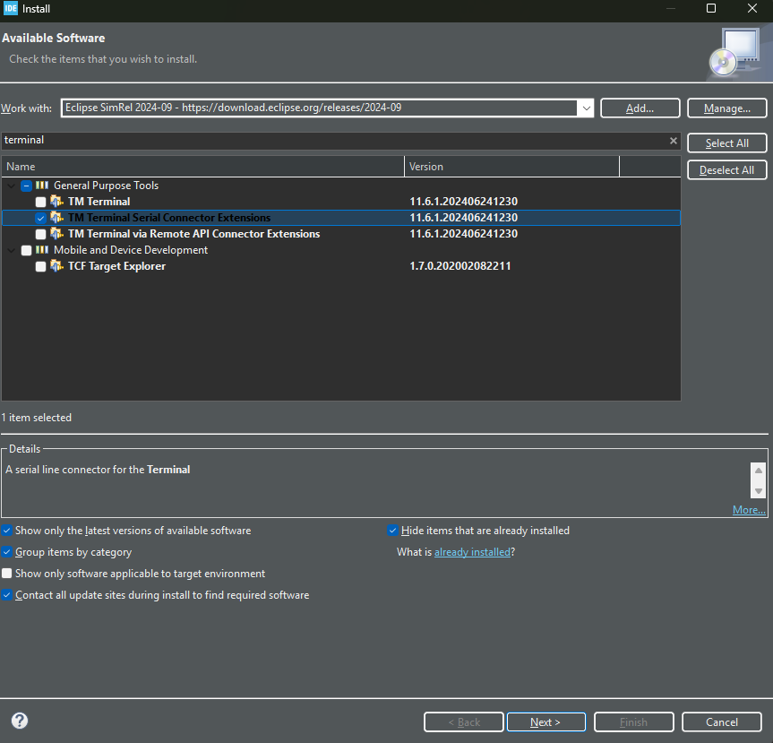
 
   f. Click <strong>Finish</strong>
      

 
   g. At the bottom right corner you wlil see the installation progress
      

 
   h. Once the installation is done, you will be prompetd to restat the IDE - Do it  
   i. Now, create a new Console and configure to accept the STM32N6 log transmissions
      
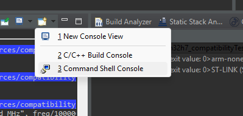
 
   j. Select <strong>Command Shell Console</strong> and fill the parameters as shown in the image
      

 
   k. Select <strong>New</strong> verify the serial port parameters as in the image
      

 
   l. Connect the STLink port of the board via a USB-C cable to the host computer and the comm port wlil be automatically filled.  
   m. Name the connection and click Finish and then click OK.
      
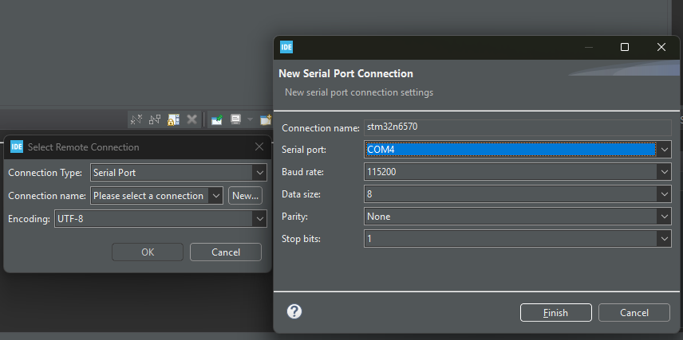
 
   n. Switch between the different console contents (build-log / run-log /  <strong>stm32n6570 output</strong>) by clicking on the blue arrow 
      

  

3. <u>Clone the Winbond's Compatibility tests repository</u>  
   The project uses Firmware Package V1.3.0 
   <u>The following SW modules are included</u>: 
   a. stm32n6_bsp\Application\Startup\              
   b. stm32n6_bsp\Application\User\                 
   c. stm32n6_bsp\Drivers\BSP\STM32N6570-DK\        
   d. stm32n6_bsp\Drivers\CMSIS\Device              
   e. stm32n6_bsp\Drivers\CMSIS\Include             
   f. stm32n6_bsp\Drivers\STM32N6xx_HAL_Driver\Inc  
   g. stm32n6_bsp\Drivers\STM32N6xx_HAL_Driver\Src  
   h. stm32n6_bsp\FSBL\Inc                          
   i. stm32n6_bsp\FSBL\Src                          
  

4. <u>Load the project</u> 
  a. In the IDE click on [File]->Import Projects from File System or Archive 
       
  b. Click on the <strong>Directory</strong> 
       
  c. At the opened GUI, Browse to the root folder of the suite and click <strong>Select Folder</strong> 
     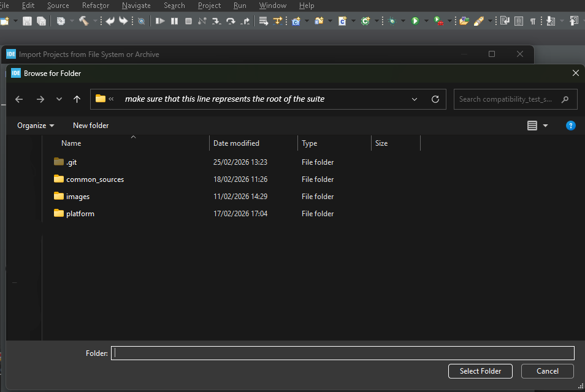  
  d. Un-select all but  the STM32N6_setup checkboxes, then, click on the <strong>Finish</strong> 
     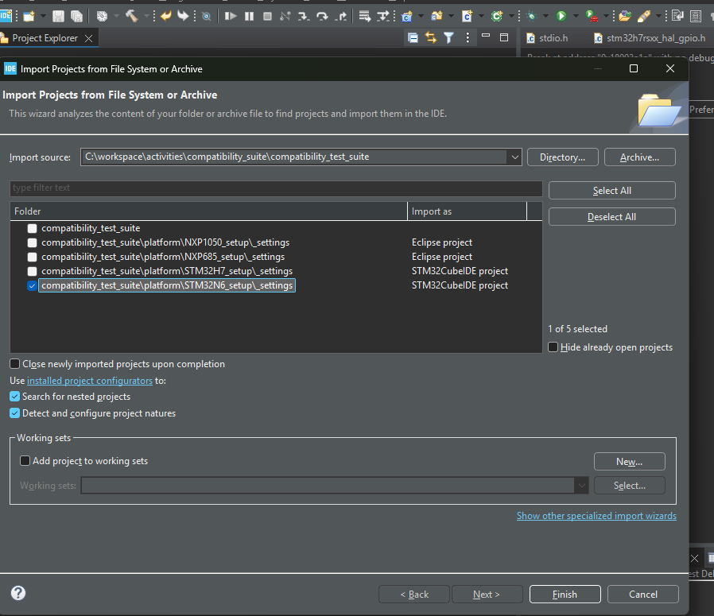  
 

5. <u>Compile</u>
   Right-click on the project -> Build Configurations -> Set Active -> Debug as the active build,  
   then, (at the above associative menu) choose <strong>Build Project</strong> or  <strong>[CTRL]+B</strong> or <strong>project->Build All</strong> 
     

6. <u>Run the test</u> 
  a. Connect the board's STMLNK port to the host computer 
  b. To receive log messages switch the console display to uart4-output (see above in the console terminal installation) 
  c. Click the Bug in Debug mode with breakpoint capability, or, click the right-pointing triangle to Run 
  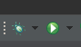 
  d. The test result enables either the green (test pass) or RED (test fail) LEDs which are located at the bottom side of the board. 
  e. <strong>Optionally</strong>, (in the case that the teraterm is running and configured)
  f. Observe the green and red LEDs 
  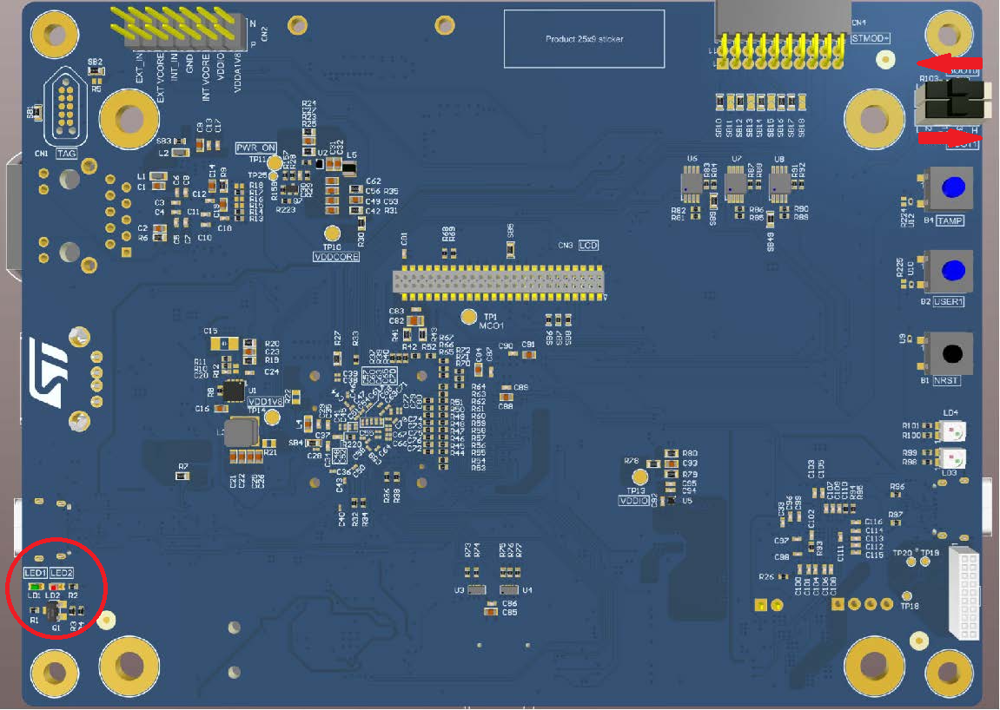  
  Example for test pass indication 
  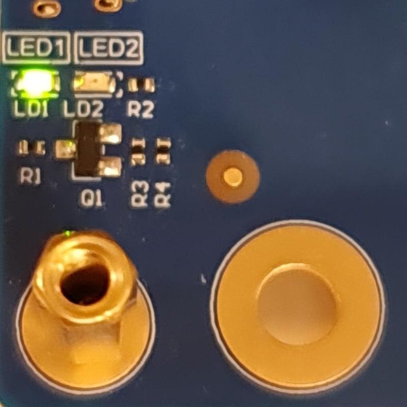  
  Example for test fail indication 
  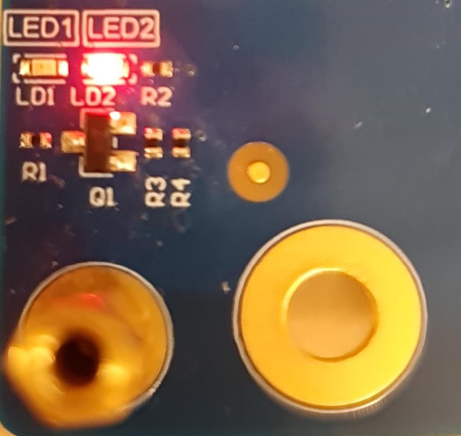  

  g. Compare the test result to the log files which are located under the logs/ folder 
  

###### (*)Note: The mentioned IDE and TERATERM versions have been validated by Winbond. Different IDE and TERATERM versions may work as well.
---
[← Return to Parent](../../../README.md)